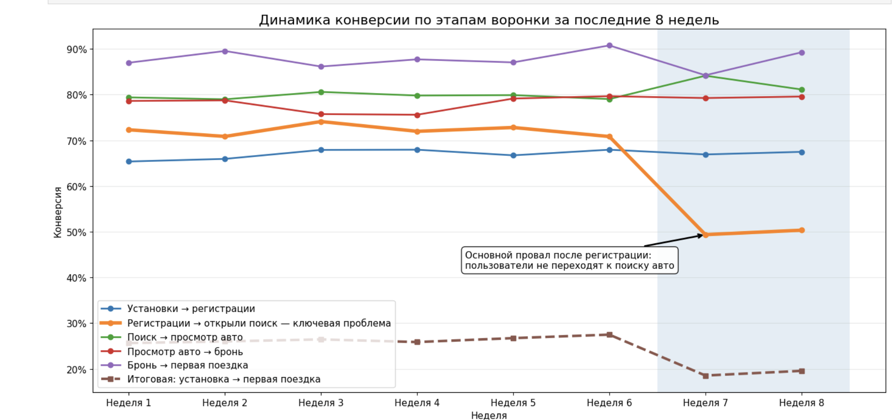

# Анализ падения конверсии по воронке

## Задача

Необходимо проанализировать данные за последние 8 недель, построить визуализацию и определить, на каком этапе воронки происходит основной отток пользователей.

## График

## Вывод

По графику видно, что итоговая конверсия из установки в первую поездку заметно снизилась в последние две недели. До 6-й недели итоговая конверсия держалась примерно на уровне 26–28%, а на 7–8 неделе снизилась примерно до 19%.

Основная проблема находится на этапе:

**Регистрации - Открыли поиск**

Именно на этом этапе произошёл самый сильный провал: конверсия снизилась примерно с 71–74% до 49–50%. Остальные этапы воронки остались относительно стабильными, поэтому главный отток связан не с бронированием или первой поездкой, а с поведением пользователя сразу после регистрации.

## Основная проблема

Пользователь проходит регистрацию, но после этого не переходит к поиску автомобиля. Это может означать, что после регистрации пользователь не понимает, что делать дальше, не видит понятного следующего шага или сталкивается с проблемами в интерфейсе приложения.

Вероятная причина - непонятный UX после регистрации, слабый онбординг или неочевидный переход к поиску авто.

## Гипотезы по увеличению конверсии

1. Сделать первый экран после регистрации более понятным.
2. Добавить заметную кнопку действия: **«Найти авто»**.
3. Добавить короткий онбординг после регистрации.
4. Проверить, нет ли технических ошибок после регистрации.
5. Проверить, не мешают ли пользователю запросы геолокации, прав доступа или верификации.
6. Упростить путь от регистрации до первого поиска автомобиля.

## Что проверить дальше

Дальше я бы проверил:

- события пользователей сразу после регистрации;
- клики на первом экране после регистрации;
- записи пользовательских сессий;
- ошибки приложения;
- различия по устройствам и версиям приложения;
- источники трафика;
- города и сегменты пользователей;
- A/B-тест нового экрана после регистрации с явным CTA к поиску авто.

## Итог

Ключевая проблема воронки - резкое падение конверсии после регистрации. Пользователи регистрируются, но не переходят к поиску автомобиля. Поэтому основная точка роста - улучшение UX и сценария первого действия после регистрации.
